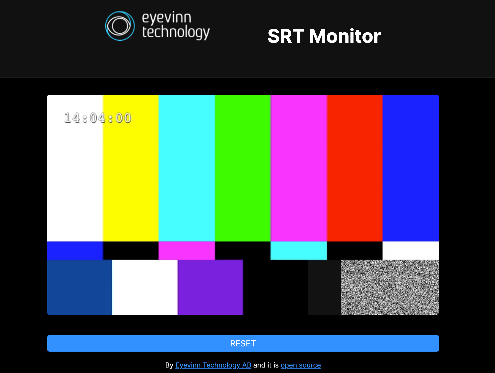

# SRT Monitor
> *Open Source SRT Web Monitor* 

[](http://slack.streamingtech.se)

A Docker container that receives and passthrough MPEG-TS over SRT while providing a WHEP (WebRTC) endpoint for monitoring in a web browser.



## Run SRT Monitor

To receive MPEG-TS on port 9998 and pass-through to port 9999.

```
SRC_PORT=9998 \
DEST_IP=<destination ip> \
DEST_PORT=9999 \
  curl -SL https://github.com/Eyevinn/srt-monitor/releases/download/v0.1.0/docker-compose.yml \
    docker-compose -f - up
```

Access the monitor at `http://localhost:3000`

## Contributing

If you're interested in contributing to the project:

- We welcome all people who want to contribute in a healthy and constructive manner within our community. To help us create a safe and positive community experience for all, we require all participants to adhere to the [Code of Conduct](docs/CODE_OF_CONDUCT.md).
- If you are looking to make a code change first learn how to setup your local development environment below. Then create a Pull Request with suggested changes.
- Report, triage bugs or suggest enhancements.
- Help others by answering questions.

## Development Environment

Install whip-mpegts from Homebrew:

```
brew install eyevinn/tools/whip-mpegts
```

Start a local WHIP/WHEP instance:

```
curl -SL https://github.com/Eyevinn/whip-whep/releases/download/v0.2.0/docker-compose.yml | \
  docker-compose -f - up
```

Start service in development / watch mode:

```
SRT_PORT=9998 \
  DEST_IP=127.0.0.1 \
  DEST_PORT=9999 \
  CMD=/opt/homebrew/bin/whip-mpegts \
  npm run dev
```

Monitor is then available at `http://localhost:3000/`. And optionally if you want to develop the UI you can start it in development mode. Then point your browser to `http://localhost:1234/` instead.

```
npm run dev:ui
```

Generate a source stream with ffmpeg:

```
ffmpeg -re -stream_loop -1 -i <FILE> -acodec copy -vcodec copy -f mpegts "srt://127.0.0.1:9998?pkt_size=1316"
```

And optionally an SRT dummmy consumer endpoint:

```
ffmpeg -re -i "srt://127.0.0.1:9999?mode=listener" -f null /dev/null
```

## License (Apache-2.0)

```
Copyright 2022 Eyevinn Technology AB

Licensed under the Apache License, Version 2.0 (the "License");
you may not use this file except in compliance with the License.
You may obtain a copy of the License at

    http://www.apache.org/licenses/LICENSE-2.0

Unless required by applicable law or agreed to in writing, software
distributed under the License is distributed on an "AS IS" BASIS,
WITHOUT WARRANTIES OR CONDITIONS OF ANY KIND, either express or implied.
See the License for the specific language governing permissions and
limitations under the License.
```

## Support

Join our [community on Slack](http://slack.streamingtech.se) where you can post any questions regarding any of our open source projects. Eyevinn's consulting business can also offer you:

- Further development of this component
- Customization and integration of this component into your platform
- Support and maintenance agreement

Contact [sales@eyevinn.se](mailto:sales@eyevinn.se) if you are interested.

## About Eyevinn Technology

[Eyevinn Technology](https://www.eyevinntechnology.se) is an independent consultant firm specialized in video and streaming. Independent in a way that we are not commercially tied to any platform or technology vendor. As our way to innovate and push the industry forward we develop proof-of-concepts and tools. The things we learn and the code we write we share with the industry in [blogs](https://dev.to/video) and by open sourcing the code we have written.

Want to know more about Eyevinn and how it is to work here. Contact us at work@eyevinn.se!